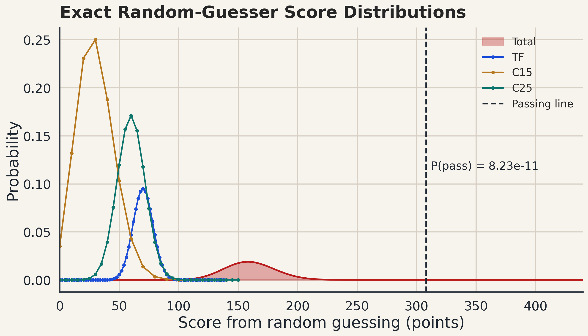
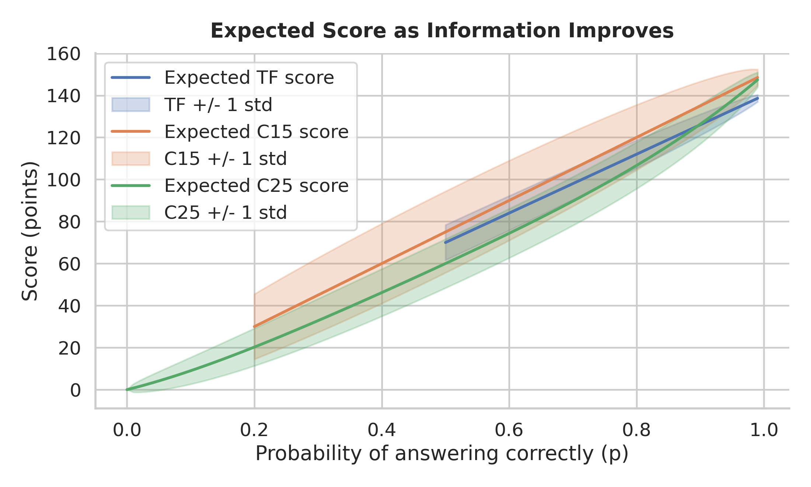
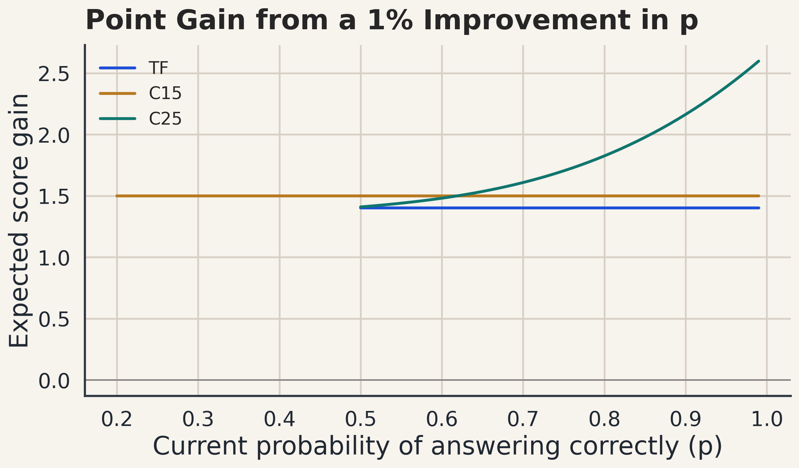
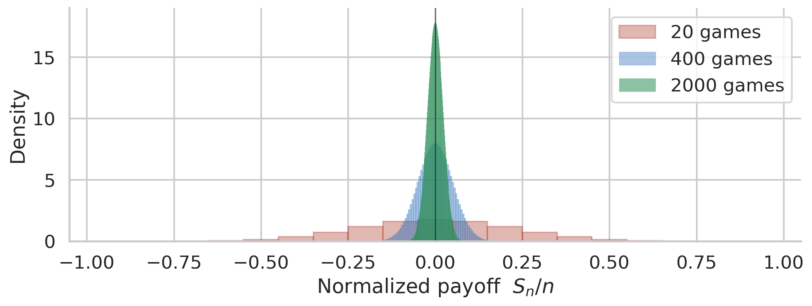
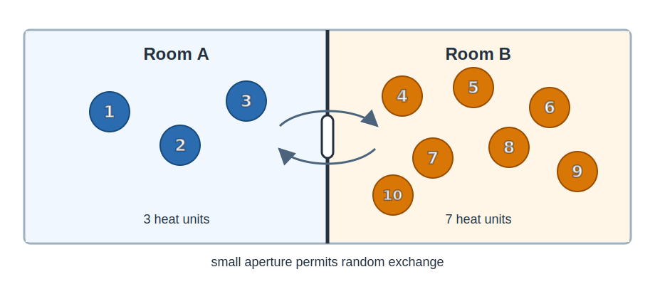

# JSDA考试的数学原理

## 目的

本文假定读者具备一定的技术与数学背景。在此前提下，建议将备考总时长控制在20小时以内，其余时间留给真正重要的工作。只要认真分析考试结构，并弄清熵的原理，一个有策略的考生就能更有效地利用题目中所蕴含的信息。

> “从同样的原理出发，我现在展示 JSDA 一类考试体系的框架。”-- 不是艾萨克·牛顿

## 建议

**建议1：把80%以上的学习时间用于衍生品交易、股票业务和债券业务。**

**建议2：五选题远比判断题重要。**

**建议3：只有在知识和常识都帮不上忙时，才把熵作为最后的辅助判断方法。**

## 目录

1. [概览](#overview)
2. [得分敏感度](#sensitivity)
   1. [随机猜题者](#random-guesser)
   2. [知情猜题者](#informed-guesser)
3. [熵](#entropy)
   1. [什么是熵](#What-is-entropy)
      1. [抛硬币](#coinflip)
      2. [咖啡、财富差距与悲观主义](#CWE)
   2. [悲观猜题者](#exam-entropy)

## 1. 概览

题型记号：

- TF = 判断题
- C15 = 五选一
- C25 = 五选二

<table>
  <thead>
    <tr>
      <th>科目（日文）</th>
      <th>科目（英文）</th>
      <th>TF</th>
      <th>C15</th>
      <th>C25</th>
      <th>总分</th>
      <th>占比</th>
    </tr>
  </thead>
  <tbody>
    <tr><td>金融商品取引法及び関係法令</td><td>Financial Instruments and Exchange Act and Related Laws</td><td>7题 / 14分</td><td>0题 / 0分</td><td>2题 / 20分</td><td>34</td><td>7.7%</td></tr>
    <tr><td>金融商品の勧誘・販売に関係する法律</td><td>Laws Related to the Solicitation and Sale of Financial Products</td><td>3题 / 6分</td><td>0题 / 0分</td><td>0题 / 0分</td><td>6</td><td>1.4%</td></tr>
    <tr><td>協会定款・諸規則</td><td>Association Articles and Rules</td><td>7题 / 14分</td><td>0题 / 0分</td><td>3题 / 30分</td><td>44</td><td>10.0%</td></tr>
    <tr><td>取引所定款・諸規則</td><td>Exchange Articles and Rules</td><td>6题 / 12分</td><td>0题 / 0分</td><td>0题 / 0分</td><td>12</td><td>2.7%</td></tr>
    <tr><td>株式業務</td><td>Equity Operations</td><td>6题 / 12分</td><td>3题 / 30分</td><td>1题 / 10分</td><td>52</td><td>11.8%</td></tr>
    <tr><td>債券業務</td><td>Bond Operations</td><td>5题 / 10分</td><td>3题 / 30分</td><td>0题 / 0分</td><td>40</td><td>9.1%</td></tr>
    <tr><td>投資信託及び投資法人に関する業務</td><td>Investment Trust and Investment Corporation Operations</td><td>7题 / 14分</td><td>2题 / 20分</td><td>0题 / 0分</td><td>34</td><td>7.7%</td></tr>
    <tr><td>付随業務</td><td>Ancillary Operations</td><td>0题 / 0分</td><td>0题 / 0分</td><td>1题 / 10分</td><td>10</td><td>2.3%</td></tr>
    <tr><td>株式会社法概論</td><td>Introduction to Corporate Law</td><td>5题 / 10分</td><td>0题 / 0分</td><td>1题 / 10分</td><td>20</td><td>4.5%</td></tr>
    <tr><td>経済・金融・財政の常識</td><td>General Knowledge of Economics, Finance, and Public Finance</td><td>0题 / 0分</td><td>0题 / 0分</td><td>2题 / 20分</td><td>20</td><td>4.5%</td></tr>
    <tr><td>財務諸表と企業分析</td><td>Financial Statements and Corporate Analysis</td><td>5题 / 10分</td><td>1题 / 10分</td><td>0题 / 0分</td><td>20</td><td>4.5%</td></tr>
    <tr><td>証券税制</td><td>Securities Taxation</td><td>6题 / 12分</td><td>1题 / 10分</td><td>0题 / 0分</td><td>22</td><td>5.0%</td></tr>
    <tr><td>証券市場の基礎知識</td><td>Basic Knowledge of Securities Markets</td><td>1题 / 2分</td><td>1题 / 10分</td><td>0题 / 0分</td><td>12</td><td>2.7%</td></tr>
    <tr><td>セールス業務</td><td>Sales Operations</td><td>4题 / 8分</td><td>0题 / 0分</td><td>0题 / 0分</td><td>8</td><td>1.8%</td></tr>
    <tr><td>デリバティブ取引</td><td>Derivatives Trading</td><td>8题 / 16分</td><td>4题 / 40分</td><td>5题 / 50分</td><td>106</td><td>24.1%</td></tr>
  </tbody>
  <tfoot>
    <tr><td><strong>合计</strong></td><td><strong>全部科目</strong></td><td><strong>70题 / 140分</strong></td><td><strong>15题 / 150分</strong></td><td><strong>15题 / 150分</strong></td><td><strong>440</strong></td><td><strong>100.0%</strong></td></tr>
  </tfoot>
</table>

看完这张表后，一个结论会立刻变得清楚：衍生品交易、股票业务、债券业务，以及协会章程及各项规则，是最重要的四个科目。

> **建议1：把80%以上的学习时间用于衍生品交易、股票业务和债券业务。**

此时，读者自然会产生两个问题：

- 那其他科目怎么办？
- 协会章程及各项规则怎么办？刚才不是说它也是最重要的科目之一吗？

不用担心。后面我会讲解其他科目的技巧。但首先，让我们看看为什么协会章程及各项规则看上去并没有那么重要。通过研究这一点，我们将学到关于这场考试的一条重要结论。

## 2. 得分敏感度

### 2.1 随机猜题者

首先，让我们研究一个完全没有任何知识或信息的人参加考试时的期望结果。在这种信息缺乏的情况下，一个完全理性的贝叶斯考生需要把所有选项视为等概率，最后变成一个随机作答者。

对于TF题，随机作答的正确概率是 `1/2`。对于C15题，随机作答的正确概率是 `1/5`。C25更有意思。因为要从5个选项中选择2个，所以共有 `C(5, 2) = 10` 种可能的组合。其中1组完全正确，得10分；6组包含一个正确答案，得5分；剩下3组得0分。

因此，使用概览表中的题数：

- TF得分服从 `2 * Binomial(70, 1/2)`
- C15得分服从 `10 * Binomial(15, 1/5)`
- C25得分服从15题的部分得分分布，其中 `P(0分) = 3/10`，`P(5分) = 6/10`，`P(10分) = 1/10`

| 题型 | 满分 | 期望得分 +/- 标准差 | 相对得分 +/- 标准差 |
| --- | ---: | ---: | ---: |
| TF | 140 | 70.00 +/- 8.37 | 50.00% +/- 5.98% |
| C15 | 150 | 30.00 +/- 15.49 | 20.00% +/- 10.33% |
| C25 | 150 | 60.00 +/- 11.62 | 40.00% +/- 7.75% |
| **合计** | **440** | **160.00 +/- 21.10** | **36.36% +/- 4.79%** |

图1概括了纯随机作答者的三种精确得分分布。

*图1. TF、C15、C25 题型中完全随机作答者的得分分布。*

现在把这三个分布加在一起。考试总分为440分，70%的合格线是308分。一个完全随机作答的考生通过考试的精确概率是 8.23e-11，也就是大约0.00000000823%。

从上面的计算可以清楚地看到，靠随机猜题通过考试几乎不可能。总体来看，C15是最重要的题型，因为五选一很难，导致期望得分率非常低。同时，它又是全对才得满分的题型，分值很重。这部分解释了第1章留下的第二个问题。协会章程及各项规则之所以没有看上去那么重要，部分原因在于它的题型主要是TF和C25，而这两类题对随机作答相对友好。但这还不是唯一原因。真实考生并不是完全随机作答者，尤其在协会章程及各项规则这样的科目中，先验概率和常识会发挥重要作用。

### 2.2 知情猜题者

在2.1节中，我们研究了完全随机作答这一特殊情形。现在我们建立一个更现实的模型：假设考生对考试内容掌握了一部分信息。熟悉信息论的读者很容易看出，我们可以用 $p$，也就是考生选中正确答案的概率，来直观表示考生掌握的信息量。

先从TF题开始。假设考生答对的概率是 $p_{tf}$，而不是随机猜题情形下精确的 $1/2$。当然，我们预期 $p_{tf} \geq 1/2$。如果不是这样，聪明的考生只要把自己认为正确的答案反过来选即可。换句话说，持续错误所需要的信息量，与持续正确所需要的信息量相同。对于任意 $p_{tf}$，我们都可以求出TF题答对总数的二项分布，并由此推出TF得分分布。接着，我们可以用同样思路评估C15的得分分布。C15很简单，因为它只是把选中正确答案的概率 $p_{15}$ 设在 `0.2` 到 `1` 之间。

C25更难建模。实践中，它的五个选项经常像是被捆在一道题里的五个TF陈述。假设考生能够以概率 $p_{25}$ 正确判断每一个陈述：真的陈述被识别为真，假的陈述被识别为假，各自的概率都是 $p_{25}$。

每道C25题有5个陈述，其中2个为真，3个为假。因此，考生认为是真的陈述数量的期望大约是 `2 * p_25 + 3 * (1 - p_25)`。这个数量可能少于也可能多于必须提交的2个选项。如果看起来为真的陈述少于2个，考生会选择这些陈述，并随机填补剩余名额。如果看起来为真的陈述多于2个，考生会在自己认为为真的陈述中随机选择2个。图2展示了期望得分随 $p$ 变化的曲线，其中 $p$ 从随机猜题的基准值开始。

现在我们可以提出一个更有用的问题：如果 $p$ 提高1个百分点，我们期望多得多少分？对于每个 $p$，这可以计算为 `expected_score(p + 0.01) - expected_score(p)`。图3只展示期望得分增量，这是比较哪类题型对小幅判断提升最敏感的最清晰方法。TF和C15的敏感度是平坦的，而C25表现出非线性行为。

*图2. 考生信息量增加时 TF、C15、C25 题型的期望得分敏感度。*

*图3. 不同题型在判断能力每提高1个百分点时，所带来的期望得分增量。*

到这里，我希望已经说服读者：C15和C25都比TF更有分量。从敏感度角度看，学习它们也更有效率，尤其是C25，因为它提供非线性的提升。总结如下：

> **建议2：五选题远比判断题重要。**

## 3. 熵

本章先用几个日常例子解释熵。我们会看到，为什么热咖啡会变冷，为什么事物更容易走向损坏而不是长期保持良好状态，以及为什么即使在公平社会中，能力相近的人长期来看也会产生巨大的财富差距。

随后，我们会看到如何把熵用于这场考试的准备。

### 3.1 什么是熵？

熵有几种定义方式：玻尔兹曼的统计力学定义、香农的信息论定义，以及 Jaynes 的贝叶斯统计定义。有知识背景的读者当然会知道，这三种方法彼此兼容，并且经常互相借用术语。本小节将尝试用类似玻尔兹曼的图像作一个简短说明。

用一句话说，我希望把熵定义为“无序/随机性的度量”，把信息定义为“相对于无序/随机性的有序程度的度量”。为了说明这一点，让我们看下一小节中的抛硬币例子。

#### 3.1.1 抛硬币

假设我们玩一个抛硬币游戏：如果是正面（记为+），你得到1美元；如果是反面（记为-），你支付1美元。在这种条件下你会害怕赌博吗？当然不会。这是一个公平游戏，而且你知道平均而言，期望收益是 $E = 0$。你大概会这样想：“如果只玩几次，我可能运气不好亏一点钱。但只要玩非常多次，应该大致赢一半、输一半。”可是，为什么会这样？

让我们考察“公平性”这个概念。公平意味着每一次抛掷的结果都是独立的，并且正反概率为50-50。如果我们玩6次，结果可以表示为类似 “+-++-+” 的字符串，其中赢4次、输2次。公平性要求任何这样的可能字符串都以相同概率发生。否则游戏就偏向某些结果。我们把这样的字符串称为 **微观状态**，之所以说它是微观，是因为字符串精确指定了每一次抛掷，因此只对应一个结果。相反，当一个人处于“总体赢2美元”的状态时，我们把它称为 **宏观状态**。显然，它之所以是宏观，是因为赢2美元有多种方式，例如 “+-++-+”、“++++--”、“++--++” 等等。

于是很明显，宏观状态对应一个或多个微观状态，而后者需要更多信息来指定。回想公平性的概念：所有微观状态在抛硬币中必须等概率。问题是：6次游戏结束后，你净收益为零的概率，比亏6美元的概率高多少？

要在6次抛硬币中亏6美元，你必须6轮全输。所以“-6美元”这个宏观状态只有一个微观状态。但净收益为零的可能性就多得多。只要总共赢3次，你就净收益为零。如果数出所有正好包含3次胜利的六字符字符串，例如 “+++---” 或 “+-+-+-”，净收益为零这个宏观状态就有20个微观状态。由于每个微观状态，也就是这里的每个字符串，都以相同概率发生，我们看到净收益为零的宏观状态比亏6美元的宏观状态可能性高20倍。

我们看到，即使游戏是公平的，有些宏观状态也会更可能出现，因为它们更“模糊”：它们对应更多微观状态。而且玩得越多，这种现象越夸张。令 $S_n$ 为 $n$ 次游戏后的累计收益。由于每局赌1美元，归一化收益 $S_n / n$ 就是每局平均收益。现在比较20次、400次和2000次游戏之后，结果落在净收益零附近的可能性。图4展示了这一分布：它会越来越集中在零附近。这在理论上很直观：游戏次数越多，零附近微观状态组合的数量增长得比其他区域快得多。读者可以自行研究数学细节，推导上一节中大量使用的二项分布，并得出结论：图4中的分布宽度以指数为1/2的多项式速度收缩。

*图4. 20次、400次、2000次公平抛硬币游戏的归一化收益分布。*

总结来说，如果你玩越来越多次，几乎必然会落在接近净收益零的中心区域。而这个“微观状态的数量”，就是我们所谓的熵。从玻尔兹曼视角看，这只是组合数学。从香农信息论视角看，更高的熵意味着更多随机性和更少秩序。在上面的例子中，净收益为零的宏观状态更加随机和混乱，因为它可以是许多微观状态中的任何一个。它的秩序更少，因为 -6美元 意味着 “------”，非常整齐；而净收益为零往往类似 “+--+-++”，并不那么整齐，不是吗？

换句话说，我们提出：从长期来看，事物会自然且不可避免地漂向更高熵的状态，即更多混乱、更多随机性和更少秩序。

#### 3.1.2 咖啡、财富差距与悲观主义

熵是大型复杂系统中的统计性质，但它也支配着很多熟悉的现象。例如，为什么热咖啡会在空调房里变冷？答案可以直接从上一小节的思路得到。想象两个房间，中间由一堵薄墙隔开，墙上有一个小孔。每个房间里都有快速运动的编号小球，代表一份份离散的热能；这些小球偶尔可以穿过小孔。图5所示的房间热交换例子中，假设A房间有3个球，B房间有7个球。如果这些球长时间随机运动，两边各5个球的均匀状态，比10个球全部在同一边的极端状态，可能性高多少？

这与抛硬币例子是同一个组合问题。微观状态指定每个带编号的小球在左边还是右边，而宏观状态只指定每边有多少个球。10个球全部在一边的宏观状态只有两个微观状态：全部在左边，或者全部在右边。相比之下，左右各5个球共有252种分法。例如，球#1、#2、#3、#4、#5可以在左边，球#1、#4、#6、#8、#9也可以在左边。因此，均分这个宏观状态的可能性，是两个极端宏观状态合计可能性的126倍。

*图5. 两个相连房间之间热能单位随机交换的示意图。*

从长时间来看，每个球在左边或右边的概率相同，所以这本质上就是抛硬币。随着球的数量从20增加到2000，分布会迅速集中在均分附近。一杯热咖啡里不是20个或2000个原子，而是大约 2 × 10²⁵ 个原子；周围空气中的原子数量还要更多。因此，咖啡冷却并不是某条额外物理规则强行规定的结果，而是统计上的结果：热能分散到周围环境中的微观状态，远远多于热能集中在咖啡中的微观状态。能量原则上可以向任一方向流动，但对于这种规模的系统，压倒性更可能的结果就是热咖啡向房间散热。

此时，读者也许会以为，上面的例子说明自然偏爱平等，因为热量倾向于均匀扩散。但这并不准确。熵并不偏爱平等本身；它只是把系统推向拥有最多微观状态的宏观状态。

考虑一个简单的财富实验。假设1,000个人一开始每人都有100美元，并不断随机与他人玩石头剪刀布。每局之后，输家向赢家支付1美元。既然所有人的起点相同，游戏也公平，人们也许会期待财富长期保持大致平等。但结果当然不是这样。随着时间推移，少数人持有总财富的大部分，几乎是不可避免的。

原因很简单：完全平等是一种极其具体的状态。钱没有标签，1美元和任何其他1美元都一样，所以每个人正好拥有100美元的分配方式只有一种。相反，不平等分布可以通过极多方式实现。第1个人可以很有钱，第84个人也可以很有钱，也可以是许多人以不同金额组合在一起。另一个极端，也就是一个人拿走所有钱，同样非常具体，因此也不太可能。最可能出现的结果位于完全平等和完全集中之间：它足够不平等，因此有许多排列方式；但又没有极端到让排列本身变得特殊。这个中间区域就是最大熵状态。因此，即使所有人平等起步，并且只玩公平游戏，大多数参与者最终也会低于平均值，而少数人会持有不成比例的更多财富。

在图6所示的模拟中，达到0美元的人不能继续输钱。即使在这种对称规则下，最初平等的分布也会迅速扩散，并开始接近红色所示的类似玻尔兹曼指数曲线。

*图6. 1,000人反复进行公平1美元博弈的财富分布模拟结果。横轴表示按区间分组后的个人财富，纵轴表示落入各财富区间的人数。模拟开始时，所有人都落在100美元这一财富区间内，但分布很快向外扩散。*

给好奇的读者补充一点：在上面的例子中，“能否区分”非常重要。这里的熵是一个组合数学概念，因此可能排列的数量取决于被计数的对象是否可以区分。把10个带编号的小球分到两个房间，和把10个完全相同的小球分到两个房间，不是同一个问题。计数方式会改变，熵也会改变。这也是基本粒子在概念上如此奇怪的原因之一。足球、杯子、分子，甚至原子，原则上都可以被贴上标签并作为单个对象追踪。但基本粒子不行。两个电子并不只是因为仪器不够精密而难以区分；它们在原则上就是同一的，不能被贴标签。这个结论受到它们被观察到的统计行为以及许多其他证据支持。如果电子原则上可以被贴标签，它们就会服从不同的统计规律，物质也会具有不同的热力学性质。事实上，如果把两个电子分别放入一个盒子中，并不存在有意义的“第一个”电子和“第二个”电子。没有“这个”电子或“那个”电子。用“可单独贴标签的电子”这个概念来计算这种系统的性质是不正确的，因为这个概念已经假设粒子能以某种方式被标记，并能在历史中被追踪。一旦采用这种假设，计算就不再反映物理现实，因此会出错。

总体而言，熵增的思想把一种客观的悲观主义摆在我们面前：从长期来看，宇宙中没有任何东西能逃脱衰败。大自然不会建造高速铁路、高楼或桥梁。如果人类建造它们之后放任不管，它们最终会倒塌。这不是因为物理学特别要求建筑倒塌，而是因为把原子排列成一个足以供人类居住和使用的结构，本身就是一种极其具体的状态。让这些原子散落、移位、腐蚀、开裂，或者以其他方式排列，有无数更多可能。所需要的只是足够多的随机过程和足够长的时间。

同样，咖啡会冷却，沙堡会被冲走，财富不平等会加剧，人体最终会停止运转。一切最终都会失败。不是因为某位古代先知向我们灌输了“失败不可避免”的观念，而是因为我们所谓的成功通常都非常具体。一个人要活着，心脏、肝脏、肺、大脑以及无数其他系统必须共同正常运作。所有东西同时正常，是一个狭窄条件；至少一个关键系统失灵，则有许多更多可能。幸福家庭也是如此：健康、金钱、孩子、住房、工作、感情、时机。太多条件必须同时成立。正如托尔斯泰在如今被称为安娜·卡列尼娜原则的话中写道：“幸福的家庭都是相似的；不幸的家庭各有各的不幸。”

在较短时间尺度和局部系统中，向高熵状态的漂移可以暂时被逆转。我们可以让某些东西比以前更有秩序，但只能通过向周围环境输出无序来实现。人类可以通过打扫房间、整理书架来降低局部熵，但要成为这种有用的行动者，我们自身必须进行代谢：我们摄入含有低熵化学自由能的食物，并把其中相当一部分转化为热量、二氧化碳、水和其他废物。在通常条件下，人体通过温度、蒸发和辐射，把这些更高熵的热量输出到环境中。建造桥梁也是同一个逻辑。桥中的原子被排列成高度特定、低熵的结构，但建造桥梁的机器和供应链会消耗燃料和电力。化石燃料燃烧时，相对有序的化学能被转化为分散的热量和废气。因此，局部秩序是用其他地方更大的熵增换来的。对于封闭系统，例如整个宇宙，总熵会在压倒性的统计趋势下持续增加，并最终趋向高熵状态。

这也有助于解释为什么热带气候中的工业生产可能更加困难。工业通过把物质排列成有用而高度特定的形式来创造局部秩序，但它必须把由此产生的无序以废热的形式排入环境。较冷的环境往往是更好的无序接收者：例如，雪可以吸收废热，并通过从有序晶体融化为更无序的液体来增加自身熵。炎热潮湿的空气已经相对混乱，因此不是排放额外废热的理想场所。如果宇宙最终变得均匀无序，以至于没有任何区域还能作为额外无序的接收处，那么像我们这样的行动者也就无法像现在这样持续降低局部熵。在充分长的时间后，这一过程预计会达到最大熵：热寂。

但这种悲观主义之外，也有值得吸收的教训。人类已经在地球上找到许多方法，能够暂时且局部地抵抗熵的增加。我们应该对此心怀感激。即使从长期来看这一切可能是徒劳的，我们仍然受益于前人的努力：我们有热咖啡、空调、桥梁和建筑。因此，问题不是事物是否会失败，因为它们当然会失败；问题是我们能对此做什么。完全无视这种悲观主义并无益处，也不应穷尽一生哀悼那随熵增而逝去的黄金时代。相反，如果我们承认事物本来就有走向失败的倾向，同时仍然追求进步，我们就能利用这种悲观主义的某些方面，孕育一个更好的世界，一个也许能够远远延续到我们生命之后的世界。在后续章节中，我会说明这种思维框架为何特别适用于 JSDA 一类考试，也许也适用于许多类似考试。

### 3.2 悲观猜题者

现在让我们回到考试。同样关于熵的直觉，可以变成判断正误题的实用工具。一个真的陈述通常是一个狭窄而高度具体的状态：它所有重要组成部分必须同时正确。相比之下，一个假的陈述可以通过许多不同方式变假。一个数字可以被改动，一个条件可以被反转，一个时间规则可以被移动，或者一个法律类别可以被替换成另一个类别。

> **例题1**
>
> **日文：**
>
> 問57. 会社法において、大会社とは、最終事業年度の貸借対照表において、資本金の額が10億円以上又は負債総額が100億円以上の株式会社をいう。
>
> **英文：**
>
> Question 57. Under the Companies Act, a large company means a stock company whose stated capital is 1 billion yen or more, or whose total liabilities are 10 billion yen or more, as shown on the balance sheet for the most recent business year.

第一步是数清这句话中的组成部分。这里有：大会社（large company）、最終事業年度（most recent business year）、貸借対照表（balance sheet）、資本金の額が10億円以上（资本金为10亿日元以上），以及負債総額が100億円以上（负债总额为100亿日元以上）。总共5个组成部分。也可以说真正的自由度只有4个，因为大会社只是定义被描述的对象。但即使采用这个保守解释，一个四组成部分的陈述也不容易为真。至少一个组成部分错误的方式有 `2^4 - 1 = 15` 种，而所有组成部分全部正确的方式只有1种。上面这道题的答案是错误：两个数字门槛都错了。正确数字是5亿日元和200亿日元。

让我们站在命题人的角度来思考。命题者的目标大概并不是刻意把题目系统性地往“真”或“假”的方向偏置，而是尽量保持两者平衡。但这种平衡比表面上更难实现。如果命题人随机修改一句陈述中的各个组成部分，得到的题库自然会偏向“假”的陈述，而不是“真”的陈述。即使每次只改动一个组成部分，一个由四个要素构成的命题，也很容易出现“80%为假、20%为真”的题库。现实中，许多考试似乎并不是通过严谨抽样来平衡这种倾向，而是通过加入更多构成要素较少的题目来控制真假比例。如果一道题只有一个有意义的构成要素，即便采用非常朴素的命题方法，也能得到接近50-50的真假分布。

这种效应的强弱取决于具体考试，而判断它的唯一可靠方法，是做大量练习题。做题时，我建议采用以下推理顺序：先用知识，再用常识，最后才用熵。如果你知道规则，就依赖规则。如果你不知道规则，就问自己这句话是否合理。例如下面的例题2中，组成部分结构很简单，所以单靠熵并不会明显支持任何一边。但常识仍然会让我们怀疑。非参加型优先股是一种特殊证券；如果它的上市审查标准与普通股完全相同，反而令人意外。在这种情况下，该陈述为真的先验概率应该相当低。最后，如果知识和常识都帮不上太多忙，组成部分计数有时可以作为有用的备用方法。

**建议3：只有在知识和常识都帮不上忙时，才把熵作为最后的辅助判断方法。**

> **例题2**
>
> **日文：**
>
> 問23. 非参加型優先株の上場審査基準は、普通株と全く同じ基準が適用される。
>
> **英文：**
>
> Question 23. For the listing examination standards for non-participating preferred shares, exactly the same standards as those for common shares are applied.

最后，我必须强调，我还没有对组成部分数量与正误之间的关系进行详细抽样研究。真实关系几乎肯定是交织的，而不是纯粹数值性的：组成部分的数量，以及每个组成部分本身在常识上的合理性，都很重要。**因此，读者绝不能盲目遵循上述原则。** 相反，应当把它当作一个在模拟考试中检验的假设，并在其中学习如何平衡知识、常识与组成部分计数。我建议所有读者在参加正式考试前，至少完成两套完整模拟题。
